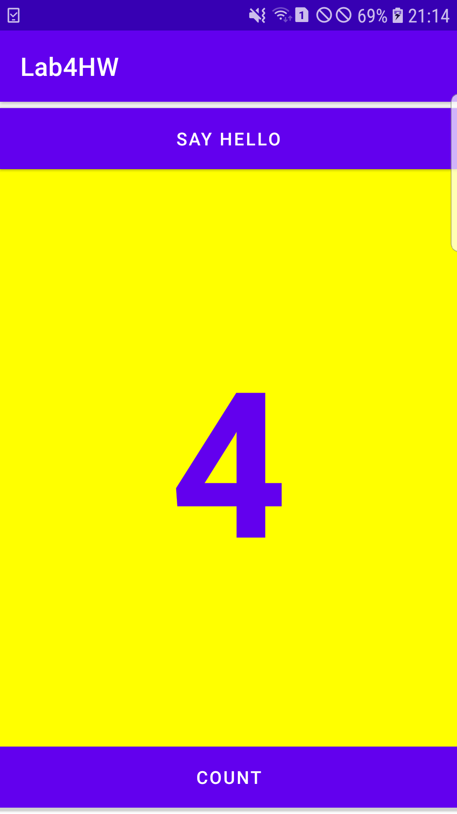
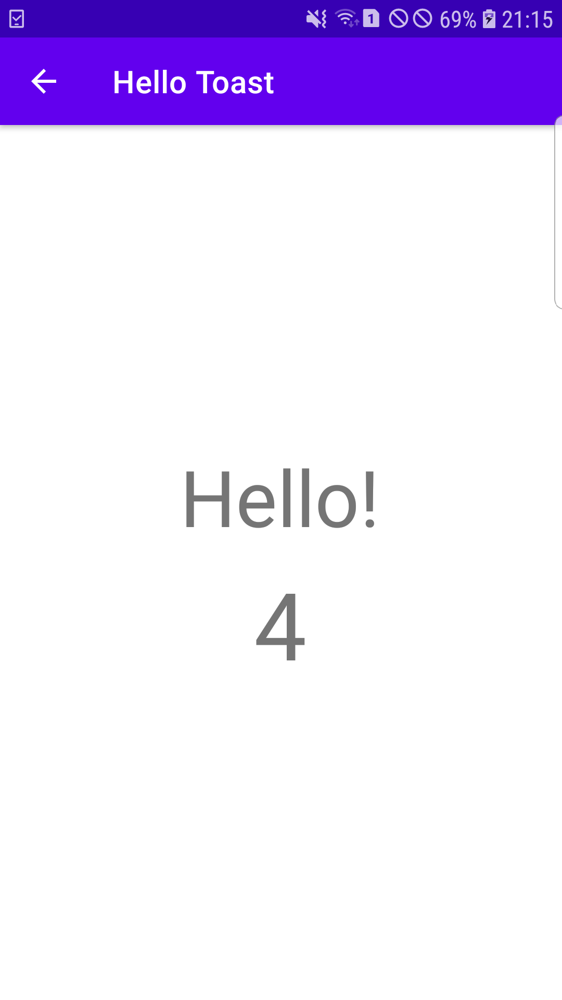

# Lab 4: Homework

**This branch consists of the tasks that was assigned in the 'Homework' section of lab 4. In this this, we were to use the hello
toast app that we created before. The modification was done in the toast button where the text in the button was set to 'Say Hello'
and pressing the button will launch a second activity displaying a greeting and the value of the count. The codes along with their
screenshots are provided within this branch.**

---

## The Final UI

**The screenshot above shows the final UI of the app that was created in this task. The UI consist of two buttons and a textView.**

**The screenshot above shows the counter value increasing on pressing the count button.**

---

## Launching the Second Activity

**The screenshot above shows the second activity being launched after the 'Say Hello' button is clicked. The second activity has 2
textViews where the upper textView displays the greeting while the lower one shows the current value of the count.**