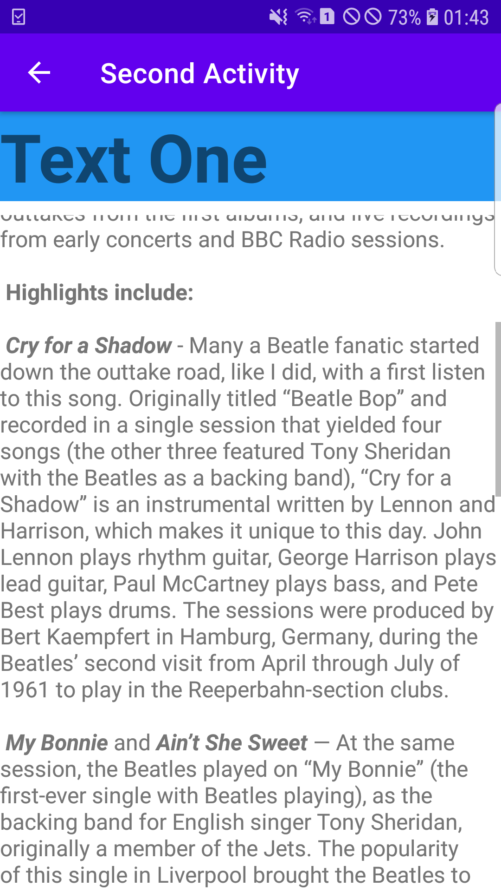
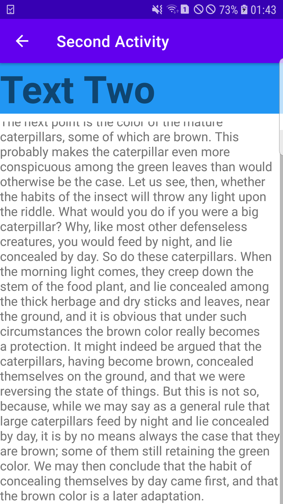
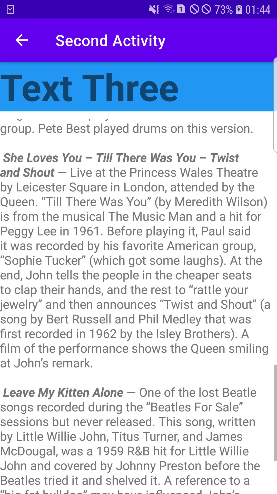

# Lab 4: Coding Challenge

**This branch consists of the 'Coding Challenge' section for the lab 4. The task was to create 3 buttons where each buttons display
a unique scrollable paragraph. This was done using intent where an activity gave rise to another activity and 'extras' were used
to display the text data for both the header and body. The screenshots for the proper completion of the task are given below.**

---

## Final App UI

**The screenshot above shows the final UI of the app created. It has 3 different buttons where each button display a unique text.**

---

## Text One

**The screenshot above shows the text body 'One' being displayed after the 'text One' button is clicked.**

---

## Text Two

**The screenshot above shows the text body 'Two' being displayed after the 'text Two' button is clicked.**

---

## Text Three

**The screenshot above shows the text body 'Three' being displayed after the 'text Three' button is clicked.**