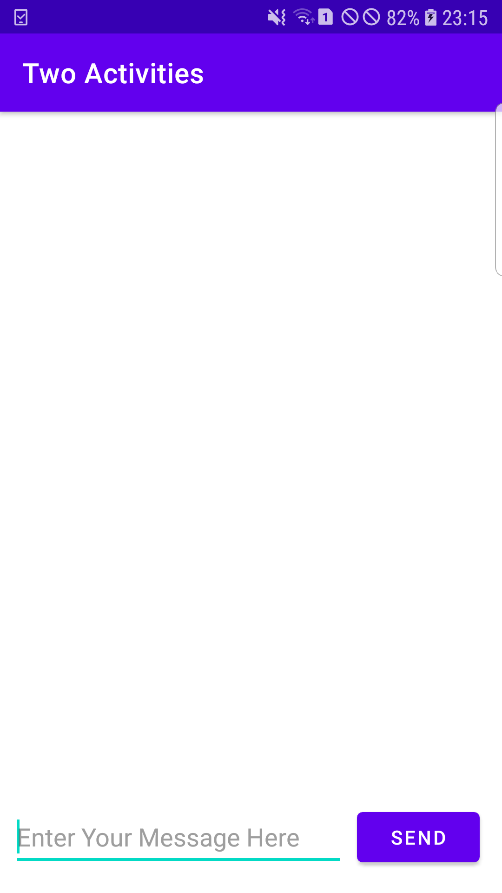

# Lab 4: Activities and Intent

**This branch consists of the task section for the lab work 4. The codes for every tasks along with their screenshots are attached
within this branch.**

**The task was to create two different activities that used intents to start and transfer data between them. The final app was
built in 3 stages where every tasks are included. We can send data from the main activity to the second created activity and
vice-versa.**

---

## Final App UI

### Main Activity UI

**The final app consists of two activities; mainActivity and secondActivity. The UI of the mainActivity has a textView to send
message and a button to send the message. Messages can be sent to the second activity from the mainActivity. In the same way,
there is also a textView that displays the message in both activities. For the main activity, the reply displaying textView is
made invisible at the beginning if no replies are received.**

### Second Activity UI

**Likewise, the UI of the secondActivity also has similar features and specifications that are shown in the screenshot below.**

---

## Sending Message from Main Activity

**The screenshot above shows the message being sent from the main activity to the second activity. It is done using an explicit
intent.**

---

## Message Received in the Second Activity

**The screenshot above shows the message received by the second activity from the main activity.**

---

## Reply Being Sent from the Second Activity

**The screenshot above shows the reply sent from the second activity to the main activity. The data (message) is sent using 
intent extras.**

---

## Reply Received by the Main Activity

**The screenshot above shows the reply received by the main activity from the second activity. In this way, lab 4 task section
was completed.**
